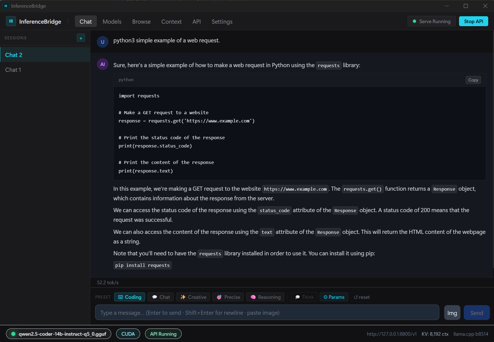
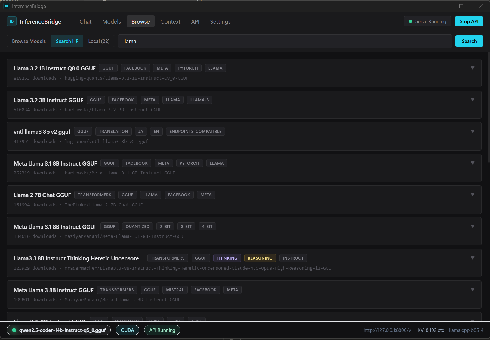
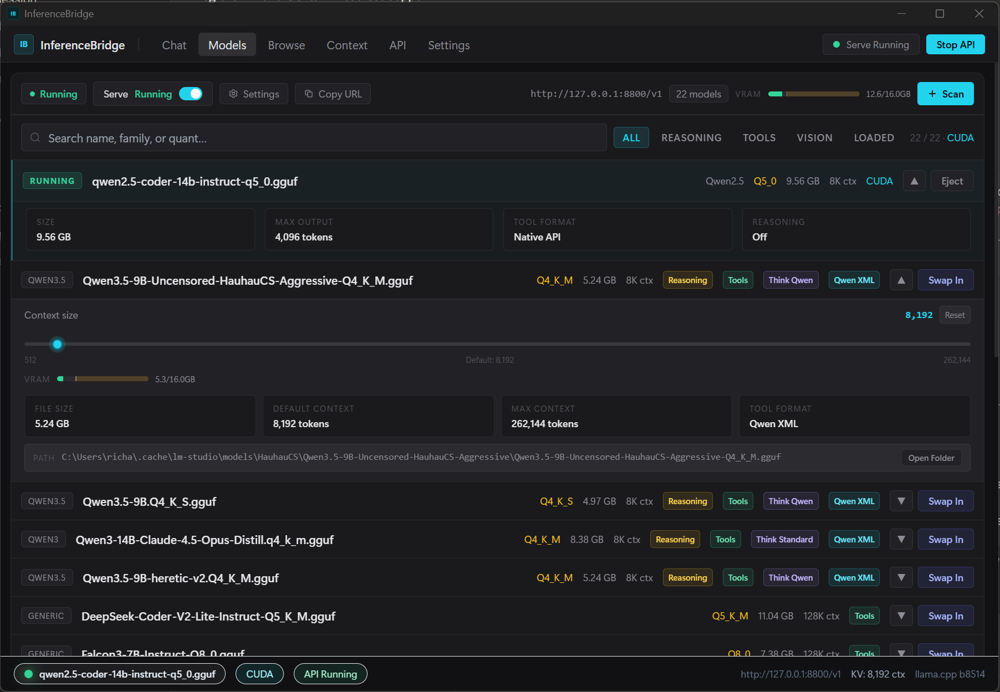
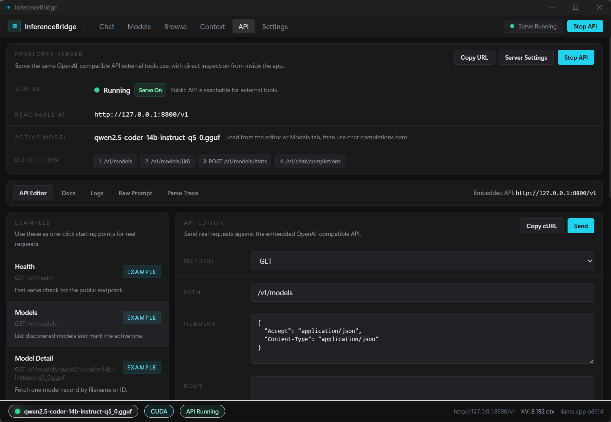

# InferenceBridge

InferenceBridge is a local LLM desktop app for running GGUF models on your own hardware with a shared OpenAI-compatible API and a clean desktop UI.

Built with Tauri (Rust) and React, it wraps `llama-server` from [llama.cpp](https://github.com/ggerganov/llama.cpp) and manages model discovery, downloads, loading, streaming chat, session history, and API serving in one app.

## Screenshots

<!-- Chat interface with streaming response -->
<div style="display: flex; gap: 20px; margin-bottom: 20px;">
  <figure style="flex: 1; text-align: center;">
    <figcaption>Chat window</figcaption>
    
  </figure>

  <figure style="flex: 1; text-align: center;">
    <figcaption>Browse HF window</figcaption>
    
  </figure>
</div>

<div style="display: flex; gap: 20px;">
  <figure style="flex: 1; text-align: center;">
    <figcaption>Models window</figcaption>
    
  </figure>

  <figure style="flex: 1; text-align: center;">
    <figcaption>API window</figcaption>
    
  </figure>
</div>

## Download

Pre-built installers are available on the [Releases](../../releases) page.

| Platform | Status |
| --- | --- |
| Windows (x64) | NSIS installer and MSI |
| macOS (Apple Silicon) | DMG |
| Linux (Ubuntu/Debian x64) | DEB and AppImage |

You do not need Rust, Node.js, or llama.cpp preinstalled. InferenceBridge can download and manage `llama-server` from inside the app.

## Features

- Browse and download GGUF models from Hugging Face
- Auto-detect local model directories and scan for `.gguf` files
- Load and unload models from the GUI or API
- Shared desktop UI and OpenAI-compatible API on the same local app state
- Streaming chat, session history, and context monitoring
- Vision image paste support for compatible models
- Interactive in-app API editor and logs workspace
- Optional API key protection for the public endpoint

## Quick Start

1. Download and install the latest release from [Releases](../../releases).
2. Open the app and go to `Settings > llama-server`.
3. Download the managed `llama-server` build for your machine.
4. Add or scan model directories, or download a model from the Browse tab.
5. Load a model from the Models tab.
6. Chat in the app or point external tools at `http://127.0.0.1:8800/v1`.

If you already have GGUF files on disk, add their folder under `Settings > Model Directories`.

## OpenAI-Compatible API

Base URL:

```text
http://127.0.0.1:8800/v1
```

If you set an API key in Settings, pass it as a Bearer token. If no API key is configured, the local endpoint is open.

### Core Endpoints

| Method | Path | Description |
| --- | --- | --- |
| `GET` | `/v1/health` | Health check |
| `GET` | `/v1/models` | List discovered models |
| `GET` | `/v1/models/{name}` | Get details for one model |
| `POST` | `/v1/models/load` | Begin loading a model |
| `POST` | `/v1/models/unload` | Unload the active model |
| `POST` | `/v1/models/stats` | Get status or load progress for a model |
| `POST` | `/v1/chat/completions` | OpenAI-style chat completions |
| `POST` | `/v1/completions` | Text completions |
| `GET` | `/v1/context/status` | Context and KV-cache status |
| `GET` | `/v1/sessions` | List saved chat sessions |
| `POST` | `/v1/sessions` | Create a chat session |
| `DELETE` | `/v1/sessions/{id}` | Delete a chat session |
| `GET` | `/v1/sessions/{id}/messages` | Get session messages |

### Example: List Models

```bash
curl "http://127.0.0.1:8800/v1/models"
```

### Example: Load a Model

```bash
curl -X POST "http://127.0.0.1:8800/v1/models/load" \
  -H "Content-Type: application/json" \
  -d "{\"model\":\"Qwen3-14B-Q4_K_M.gguf\"}"
```

### Example: Poll Model Status

```bash
curl -X POST "http://127.0.0.1:8800/v1/models/stats" \
  -H "Content-Type: application/json" \
  -d "{\"model\":\"Qwen3-14B-Q4_K_M.gguf\"}"
```

### Example: Chat Completion

```bash
curl "http://127.0.0.1:8800/v1/chat/completions" \
  -H "Content-Type: application/json" \
  -H "Authorization: Bearer your-key-here" \
  -d '{
    "model": "Qwen3-14B-Q4_K_M.gguf",
    "messages": [{"role": "user", "content": "Hello"}],
    "stream": false
  }'
```

## Debug Workspace

The Debug tab includes:

- API serve controls
- a built-in API editor
- recent request history
- logs
- raw prompt and parse trace views

See [docs/04-debug-api-workspace.md](docs/04-debug-api-workspace.md) for example flows and cURL snippets.

## Configuration

InferenceBridge stores configuration in:

| OS | Path |
| --- | --- |
| Windows | `%APPDATA%\InferenceBridge\inference-bridge.toml` |
| macOS | `~/Library/Application Support/InferenceBridge/inference-bridge.toml` |
| Linux | `~/.config/InferenceBridge/inference-bridge.toml` |

Example:

```toml
[server]
host = "127.0.0.1"
port = 8800
api_key = ""
autostart = true

[models]
scan_dirs = [
  "C:\\Users\\You\\models",
]

[process]
gpu_layers = -1
threads = 0
```

## Building From Source

Requirements:

- Rust 1.75+
- Node.js 18+
- platform build tools for Tauri

```bash
git clone https://github.com/AssassinUKG/InferenceBridge
cd InferenceBridge
npm install
npm run tauri build
```

Release bundles are written to `src-tauri/target/release/bundle/`.

For development:

```bash
npm run tauri dev
```

## GitHub Actions

This repo uses three GitHub Actions workflows:

- `CI`
  runs quick validation on pushes and pull requests
  includes `npm run build` and `cargo check`
- `Build`
  builds desktop artifacts on pushes and by manual trigger from the Actions tab
  uploads build artifacts to the workflow run
- `Release`
  creates a draft GitHub Release when you push a version tag like `v0.1.0`

### Trigger a normal build

Push your branch:

```bash
git push origin master
```

Or open the `Actions` tab on GitHub and run the `Build` workflow manually.

### Trigger a release build

```bash
git tag v0.1.0
git push origin v0.1.0
```

That will run the `Release` workflow and create a draft release with platform installers.

## Project Docs

- [docs/01-migration-design-note.md](docs/01-migration-design-note.md)
- [docs/02-architecture.md](docs/02-architecture.md)
- [docs/03-implementation-plan.md](docs/03-implementation-plan.md)
- [docs/04-debug-api-workspace.md](docs/04-debug-api-workspace.md)
- [docs/05-inference-runtime-roadmap.md](docs/05-inference-runtime-roadmap.md)

## License

MIT. See [LICENSE](LICENSE).
