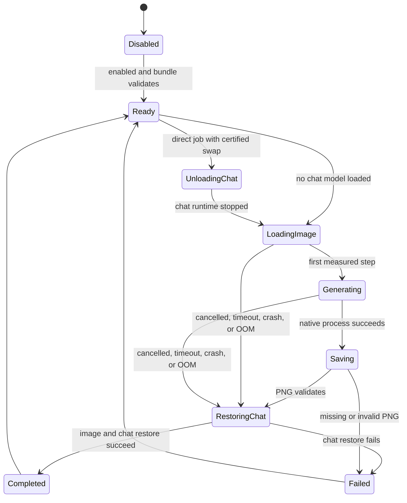

# Image Generation Integration Plan

## Decision

Image generation is a worthwhile InferenceBridge capability when it is a native, code-owned tool rather than a prompt that lets every chat model pretend it can draw.

The separate `image-gen-lab` proved the proposed local stack on the target RTX 3090:

| Profile tested | Result | Wall time | Peak VRAM | Peak temperature |
| --- | --- | ---: | ---: | ---: |
| Qwen-Image-2512 Q6, 1024x1024, 50 steps | Recommended quality default | about 190-194 s | about 19.4 GB | 81-84 C |
| Qwen-Image-2512 Q6, 1328x1328, 50 steps | Optional maximum quality | about 347 s | about 20.1 GB | 87 C |

All eight real lab generations completed. Repeated generation with the same seed was deterministic. The tested image set included a surfing cat, exact text on a cafe sign, and hands shaping pottery; visual inspection found all three coherent. See [`image-gen-lab/reports/ASSESSMENT.md`](../image-gen-lab/reports/ASSESSMENT.md) for the full evidence.

The production quality default is therefore Q6 at 1024x1024 and 50 steps. Q8 is not justified yet: it would consume more disk and VRAM before demonstrating a visible quality improvement. The 1328 square profile remains an explicit maximum-quality choice with a temperature warning.

## Integrated test evidence

The release desktop build was tested through the InferenceBridge chat UI on 23 July 2026:

- A cold Qwen-Image-2512 Q6 generation at 1024x1024 and 50 steps completed in about 3.5 minutes.
- The generated PNG was 2.3 MB and passed both PNG validation and visual inspection.
- The live run peaked at about 19.5 GB VRAM and 81 C.
- The result persisted as a session attachment and reloaded in chat with Save copy and Show in folder actions.
- A second cold run displayed the loading stage, percentage, elapsed time, ETA placeholder, and Cancel action.
- Cancelling that run stopped the native process, returned VRAM to the idle state, and left no partial PNG.

The cancellation result verifies the no-chat-model Phase 1 path. It does not certify automatic restoration because the chat runtime was intentionally unloaded and the production swap gate remained off.

## Capability boundary

Image generation is an InferenceBridge tool, not an ability inherited by whichever language model is loaded.

- The image runtime owns the Qwen-Image transformer, Qwen2.5-VL text encoder, and VAE as one validated bundle.
- A chat model may request the tool only after a code router and tool executor are connected.
- Capability truth remains `false` for ordinary desktop chat until that executable tool path exists.
- Prompts do not advertise DALL-E, image generation, or tools IB cannot execute.
- The image runner receives an allowlist of typed arguments. Arbitrary command-line arguments are not accepted.

## Runtime state machine

Image work shares the existing global model lifecycle lock. This prevents a chat model load, API request, settings change, or swap from racing a large image-model allocation.

## User-visible progress

The chat progress card is driven by native runner output:

- stage: unloading chat, loading image runtime, generating, saving, restoring chat, completed, cancelled, or failed;
- current step and total steps;
- measured percentage;
- elapsed time;
- estimated remaining time once a real seconds-per-step sample exists;
- cancellation;
- final output path or actionable failure text.

The UI advances its elapsed clock locally between native events, but it does not invent generation steps. Loading displays "estimating" until the runner provides enough data. Stream updates do not force the conversation back to the bottom after the user scrolls upward.

Cancellation kills and waits for the child process, drains its output pipes, and removes a partial PNG. Output is accepted only when it has a valid PNG header and the configured dimensions.

## Size and quality controls

The direct image action exposes:

- the measured 1024x1024 square default;
- official Qwen aspect presets for 1:1, 16:9, 9:16, 4:3, 3:4, 3:2, and 2:3;
- 30, 40, 50, or 60 steps;
- random or fixed seed;
- advanced CFG scale, sampler, and negative-prompt controls.

The default remains Q6, 1024x1024, 50 steps, CFG 2.5, and Euler sampling because that is the tested quality point. The 1328 square and other large official sizes are opt-in.

## Thermal policy

- Warn at 85 C by default.
- Do not begin another unattended queued job until the GPU has cooled below 70 C.
- Keep 1328x1328 maximum quality opt-in.
- Do not change GPU fan, voltage, or power settings from IB.
- Record temperature and VRAM samples in a later telemetry phase; the current settings store the thresholds but do not yet enforce the cooldown.

## Delivery phases

### Phase 1 - safe native foundation

- [x] Typed image bundle and quality-profile configuration.
- [x] Bundle, runner, prompt, profile, and output validation.
- [x] Exact native argument preview.
- [x] Single-job lock and shared model lifecycle lock.
- [x] Direct process launch without a shell.
- [x] Cancellation, timeout, output validation, and partial-file cleanup.
- [x] Parsed step progress, elapsed time, and ETA events.
- [x] In-chat progress card.
- [x] Settings UI for runner, bundle files, output, and default profile.
- [x] One-click detection of the tested `image-gen-lab` installation.
- [x] Direct image action with size/aspect, steps, seed, CFG, sampler, and negative prompt controls.
- [x] Q6 at 1024x1024 and 50 steps selected as the quality default.

Direct generation is available when no chat model is loaded. The chat composer remains available in that state so the user can generate without loading a language model.
In that mode, the primary composer button and Enter key immediately generate with the Q6 1024x1024 / 50-step quality defaults; the separate image-options button remains available for custom sizes, steps, seeds, samplers, CFG, and negative prompts.

### Phase 2 - exact swap and recovery

- [x] Save an exact last-known-good runtime snapshot, not just a model filename.
- [x] Share the model lifecycle lock and reserve the GPU against new chat/API work.
- [x] Stop the chat runtime before starting the image child process.
- [x] Restore the same context, template, reasoning, sampler, projector, MTP, and extra runtime arguments.
- [x] Route success, cancellation, timeout, native crash, invalid output, and OOM-style process failure through restoration.
- [x] Surface "restoring chat" as a distinct progress stage.
- [ ] Run and record cancellation, timeout, crash, OOM, and invalid-output recovery tests.
- [ ] Pass and record ten consecutive image/chat swap cycles without a ghost process or lost chat configuration.

The production safety gate `automatic_model_swap_enabled` defaults to `false`. Automatic swapping remains disabled until every open recovery test above passes. Users can unload the chat model manually and use direct image generation in the meantime.

### Phase 3 - chat tool and attachments

- [ ] Add an explicit image-generation tool schema to the code-owned router.
- [ ] Permit only models and sessions whose runtime policy allows tool use to request it.
- [x] Store direct generated images as session attachments with prompt, seed, profile, and bundle provenance.
- [x] Render generated images in the conversation with save and reveal-in-folder actions.
- [x] Present generated images as result cards with model/quantization, dimensions/aspect, steps, CFG, sampler, seed, render time, file size, completion time, and expandable prompt provenance.
- [ ] Add a reuse-seed action.
- [ ] Return a concise tool result to the chat model after the original model is restored.
- [x] Add a direct UI action so image generation does not depend on a model making a tool call.

Once the router work is complete, any competent chat model can use IB to make images through the validated tool. The chat model plans and describes; Qwen-Image renders.

### Phase 4 - API and queue

- [ ] Add `POST /v1/images/generations`.
- [ ] Add job status and cancellation endpoints or events.
- [ ] Support one active GPU job and a bounded queue.
- [ ] Apply the thermal cooldown gate between unattended jobs.
- [ ] Keep image capability metadata separate from chat-model metadata.

## Acceptance tests

- Missing, relative, or wrong-type component paths fail before process launch.
- Prompts containing quotes or command syntax remain one process argument.
- Concurrent image requests do not overlap.
- Chat load/swap cannot race an image job.
- Cancellation returns promptly and leaves no partial PNG or child process.
- Timeout and native crash leave the runtime able to start another job.
- A successful job returns the correct PNG dimensions, seed, profile, and path.
- Progress is monotonic and duplicate native step lines do not create duplicate updates.
- ETA appears only after measured step timing exists.
- Scrolling upward during progress is not overridden.
- Phase 2 passes recovery after success, cancellation, timeout, invalid output, and OOM.
