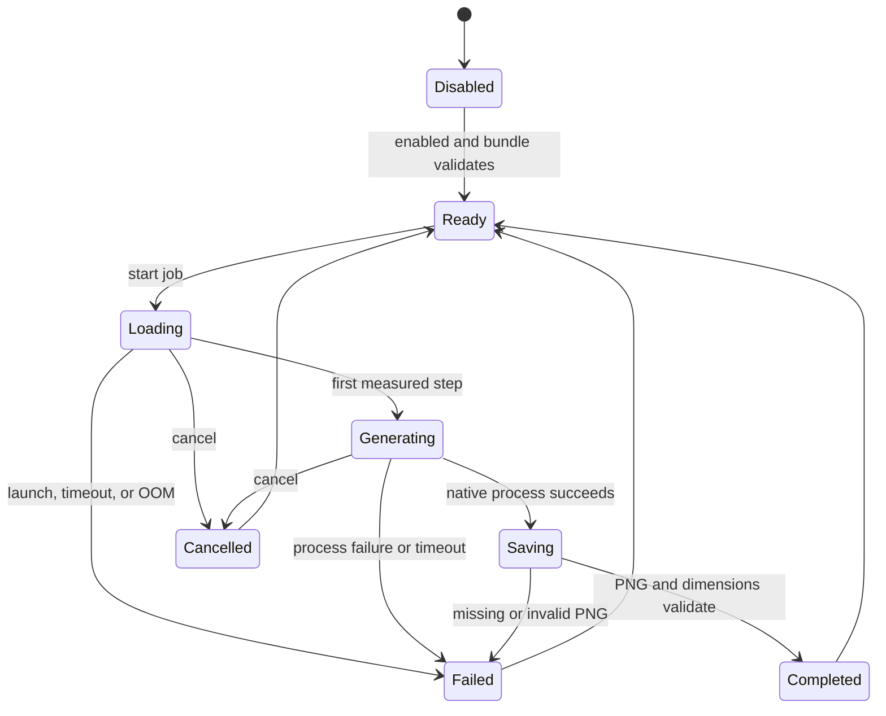

# Image Generation Integration Plan

## Decision

Image generation is a worthwhile addition to InferenceBridge, provided it is a native capability with explicit runtime state rather than a prompt that lets every chat model pretend it can draw.

The separate `image-gen-lab` proved the proposed local stack on the target RTX 3090:

| Profile tested | Result | Wall time | Peak VRAM | Peak temperature |
| --- | --- | ---: | ---: | ---: |
| Qwen-Image-2512 Q6, 1024x1024, 50 steps | Recommended quality default | about 190-194 s | about 19.4 GB | 81-84 C |
| Qwen-Image-2512 Q6, 1328x1328, 50 steps | Optional maximum quality | about 347 s | about 20.1 GB | 87 C |

All eight real generations completed. Repeated generation with the same seed was deterministic. The tested image set included a surfing cat, exact text on a cafe sign, and hands shaping pottery; visual inspection found all three coherent. See [`image-gen-lab/reports/ASSESSMENT.md`](../image-gen-lab/reports/ASSESSMENT.md) for the full evidence.

The first production default should therefore be Q6 at 1024x1024 and 50 steps. Q8 is not justified yet: it would consume more disk and VRAM before it has demonstrated a visible quality improvement. The 1328 profile should remain an explicit maximum-quality choice with a temperature warning.

## Capability boundary

Image generation is an InferenceBridge tool, not an ability inherited by whichever language model is loaded.

- The image runtime owns the Qwen-Image transformer, Qwen2.5-VL text encoder, and VAE as one validated bundle.
- A chat model may request the tool only after a code router and tool executor are connected.
- Capability truth remains `false` for ordinary desktop chat until that executable path exists.
- Prompts do not advertise DALL-E, image generation, or other tools that IB cannot execute.
- The image runner receives a fixed allowlist of typed arguments. Arbitrary command-line arguments are not accepted.

## Runtime state machine

Image work shares the existing global model lifecycle lock. This prevents a chat model load or swap from racing a large image-model allocation.

## User-visible progress

The chat progress card is driven by native runner output:

- stage: loading, generating, saving, completed, cancelled, or failed;
- current step and total steps;
- measured percentage;
- elapsed time;
- estimated remaining time, once a real seconds-per-step sample exists;
- a cancellation control;
- final output path or actionable failure text.

The UI advances its elapsed clock locally between native events, but it does not invent generation steps. Loading displays “estimating” until the runner provides enough data. Stream updates do not force the conversation back to the bottom after the user scrolls upward.

Cancellation kills and waits for the child process, drains its output pipes, and removes a partial PNG. Output is accepted only when it has a valid PNG header and the configured dimensions.

## Thermal policy

- Warn at 85 C by default.
- Do not begin another unattended queued job until the GPU has cooled below 70 C.
- Keep 1328x1328 maximum quality opt-in.
- Do not change GPU fan, voltage, or power settings from IB.
- Record temperature and VRAM samples in a later telemetry phase; the initial runner already exposes the configured thresholds.

## Delivery phases

### Phase 1 — safe native foundation

- [x] Typed image bundle and quality-profile configuration.
- [x] Bundle, runner, prompt, profile, and output validation.
- [x] Exact native argument preview.
- [x] Single-job lock and shared model lifecycle lock.
- [x] Direct process launch without a shell.
- [x] Cancellation, timeout, output validation, and partial-file cleanup.
- [x] Parsed step progress, elapsed time, and ETA events.
- [x] In-chat progress card.
- [ ] Settings UI for choosing the runner, bundle files, and default profile.

During this phase, generation is allowed only when no chat model or chat generation is active.

### Phase 2 — exact swap and recovery

- Save the exact last-known-good `LaunchPreview`, not just a model filename.
- Stop the chat runtime and prove that the process and API port are released.
- Run one image job under the same lifecycle lock.
- Restore the chat model with the same context, template, reasoning, sampler, projector, and MTP settings.
- Restore on success, cancellation, timeout, native crash, invalid output, and OOM.
- Surface “image ready, restoring chat” as a distinct progress stage.
- Pass ten consecutive image/chat swap cycles without a ghost process or lost chat configuration.

Automatic swapping must remain disabled until all of these recovery paths pass.

### Phase 3 — chat tool and attachments

- Add an explicit image-generation tool schema to the code-owned router.
- Permit only models/sessions whose runtime policy allows tool use to request it.
- Store the generated image as a session attachment with prompt, seed, profile, and bundle provenance.
- Render the image in the conversation with save, reveal-in-folder, and reuse-seed actions.
- Return a concise tool result to the chat model after the original model is restored.
- Add a direct UI action so image generation does not depend on a model making a tool call.

At the end of this phase, any competent chat model can use IB to make images through the same validated tool. The chat model plans and describes; Qwen-Image renders.

### Phase 4 — API and queue

- Add `POST /v1/images/generations`.
- Add job status and cancellation endpoints or events.
- Support one active GPU job and a bounded queue.
- Apply the thermal cooldown gate between unattended jobs.
- Keep image capability metadata separate from chat-model metadata.

## Acceptance tests

- Missing, relative, or wrong-type component paths fail before process launch.
- Prompts containing quotes or command syntax remain one process argument.
- Concurrent image requests do not overlap.
- Chat load/swap cannot race an image job.
- Cancellation returns promptly and leaves no partial PNG or child process.
- Timeout and native crash leave the runtime able to start another job.
- A successful job returns the correct PNG dimensions, seed, profile, and path.
- Progress is monotonic and duplicate native step lines do not create duplicate updates.
- ETA appears only after measured step timing exists.
- Scrolling upward during progress is not overridden.
- Phase 2 passes recovery after success, cancellation, timeout, invalid output, and OOM.

